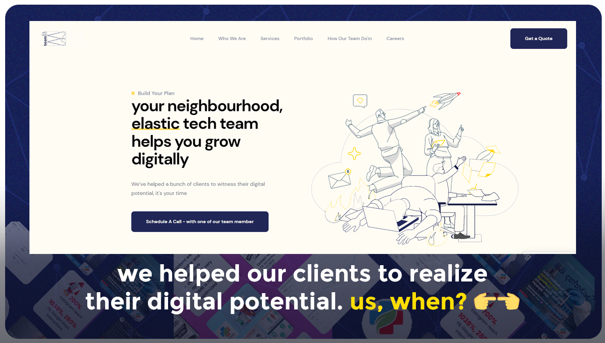

<div align="center">
  
  
  
  
  [](https://twitter.com/intent/follow?screen_name=0xgthuvaDEV)
  [
    
  <br />
  <br />

  <h2 align="center">teamW2S - not another internet company</h2>

  teamw2s is a digital agency based in Sri Lanka, <br />offering a bunch of services to its clientele, helps to make their digital presence sassy.

  <a href="https://0xgthuva.github.io/teamw2s/"><strong>➥ Live Demo of our website</strong></a>

</div>

<br />

### Demo Screeshots updated



### Prerequisites

Before you begin, ensure you have met the following requirements:

* [Git](https://git-scm.com/downloads "Download Git") must be installed on your operating system.

### Run Locally

To run **teamw2s** locally, run this command on your git bash:

Linux and macOS:

```bash
sudo git clone https://github.com/0xgthuva/teamw2s.git
```

Windows:

```bash
git clone https://github.com/0xgthuva/teamw2s.git
```

### Contact

We are busy with your competitors, but still we have some time to connect, buzz me on [Twitter](https://www.twitter.com/0xgthuvaDEV) / [LinkedIn](https://www.linkedin.com/in/0xgthuva/) / [Instagram](https://www.instagram.com/0xgthuva.jpg/).

### License

Good artists copy, Great artists don't steal, they get inspire from others work.
